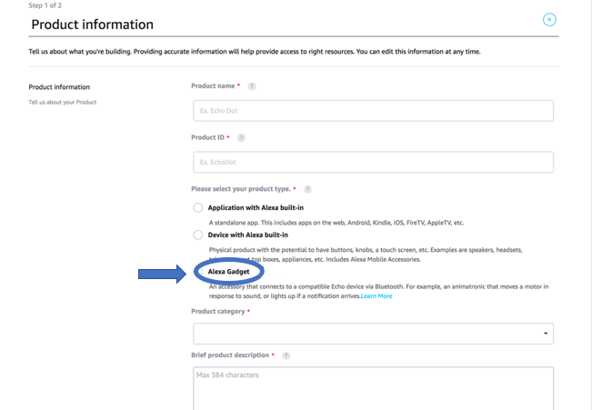
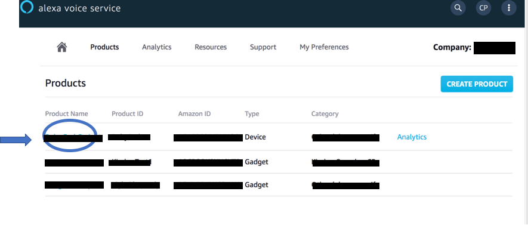
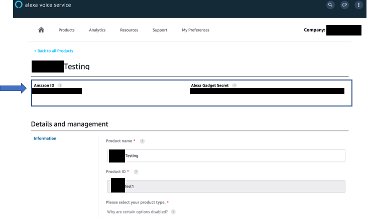

# smart-contact-lens-case


75614408_690960174771936_8153552063456870400_n.gif

Quickly create an Alexa Gadget using a Raspberry Pi, Python, and the [Alexa Gadgets Toolkit](https://developer.amazon.com/alexa/alexa-gadgets).

- [Prerequisites](#prerequisites)
- [Installation](#installation)
- [Registering a gadget in the AVS Developer Console](#registering-a-gadget-in-the-alexa-voice-service-developer-console)
- [Install GrovePi library](#Iinstall-grovepi-library)

## Prerequisites

- Raspberry Pi 3 B+ ([Starter Kit](https://www.amazon.com/CanaKit-Raspberry-Complete-Starter-Premium/dp/B07BLRSKBV)) or later version that supports *Bluetooth 4.2* with an internet connection.
- A [Micro SD card](https://www.amazon.com/SanDisk-Mobile-MicroSDHC-SDSDQM-B35A-Adapter/dp/B004ZIENBA/) with a minimum of 8GB of space and the latest version of [Raspian](https://www.raspberrypi.org/downloads/raspbian/) installed.
- An [Amazon Developer account](https://developer.amazon.com/alexa). If you don't already have a developer account, create one.
- An Echo device that is compatible with Alexa Gadgets. [Learn more](https://developer.amazon.com/docs/alexa-gadgets-toolkit/overview-bluetooth-gadgets.html#device-bluetooth-support)
- [Grove Buzzer](http://wiki.seeedstudio.com/Grove-Buzzer/), [Grove Button](http://wiki.seeedstudio.com/Grove-Button/), 2x [Grove Chained LED](https://www.seeedstudio.com/Grove-Chainable-RGB-Led-V2-0.html), and [Grove Pi Shield](https://www.seeedstudio.com/GrovePi-p-2241.html)

If you need help getting your Raspberry Pi set up, there are a number of guides available online with instructions; you may want to [follow this one](https://hackernoon.com/raspberry-pi-headless-install-462ccabd75d0). Make sure your Raspberry Pi is up-to-date with the latest updates.

> **Note:** The examples require header pins, but you do not need to add them now. You can [solder them on](https://www.adafruit.com/product/3907) later or order a board that [already has them](https://www.adafruit.com/product/3708)

## Registering a gadget in the Alexa Voice Service Developer Console

To create a gadget that works with your Echo device, you first need to register a new gadget in the [Alexa Voice Service Developer Console](https://developer.amazon.com/avs/home.html#/avs/home).

1. Sign in to the [Alexa Voice Service Developer Console](https://developer.amazon.com/avs/home.html#/avs/home). If you don't already have a developer account, create one.

    

2. If you haven't registered an AVS product in the past, click **GET STARTED**.

    

3. Click **PRODUCTS**, and then click **CREATE PRODUCT**.

    

4. Fill out the requested information, select **Alexa Gadget** as the product type, and then click **FINISH**.

    

5. In the pop-up, click **OK**.
6. You will be taken to a list of your products. Click on the gadget you just created.

    

7. At the top, you'll see an **Amazon ID** and **Alexa Gadget Secret**. You'll need these for the following steps to create your Alexa Gadget. Keep this ID and Secret private because they uniquely identify your gadget.

    

To learn more, refer to [Register a Gadget](https://developer.amazon.com/docs/alexa-gadgets-toolkit/register-gadget.html) in the Alexa Gadgets Toolkit documentation.

## Installation

To setup your Raspberry Pi as an Alexa Gadget, you will need to download and install some Python and Debian packages. To run the following commands, you will need to be connected to your Pi via SSH or VNC, or be running them directly using a keyboard, mouse, and monitor connected to your Pi. Make sure your Pi is connected to the internet.

Download Alexa-Gadgets-Raspberry-Pi-Samples repo from GitHub using one of the following ways:

* **Using git clone:**
    - In your terminal:
        ```
        git clone https://github.com/alexa/Alexa-Gadgets-Raspberry-Pi-Samples.git
        ```
    - If you didn't clone the repo directly on your Pi, you can transfer it to your Pi using the `scp` [command](https://www.raspberrypi.org/documentation/remote-access/ssh/scp.md)
        ```
        scp -r Alexa-Gadgets-Raspberry-Pi-Samples pi@192.168.0.1:~/Alexa-Gadgets-Raspberry-Pi-Samples
        ```
    **Note:** Replace `192.168.0.1` with the IP address of your Pi.
* **Using GitHub Web UI:**
    - Click on the **Clone or download** button and click on **Download ZIP**.
    - Unzip the downloaded `Alexa-Gadgets-Raspberry-Pi-Samples-master.zip` file:
        ```
        unzip Alexa-Gadgets-Raspberry-Pi-Samples-master.zip
        ```
    - If you didn't download & unzip the repo directly on your Pi, you can transfer it to your Pi using the `scp` [command](https://www.raspberrypi.org/documentation/remote-access/ssh/scp.md)
        ```
        scp -r Alexa-Gadgets-Raspberry-Pi-Samples-master pi@192.168.0.1:~/Alexa-Gadgets-Raspberry-Pi-Samples
        ```

    **Note:** Replace `192.168.0.1` with the IP address of your Pi.

Once you have the `Alexa-Gadgets-Raspberry-Pi-Samples` repo on your Pi, go into the `Alexa-Gadgets-Raspberry-Pi-Samples` folder

```
cd /home/pi/Alexa-Gadgets-Raspberry-Pi-Samples/
```

Here, you will find the `launch.py` script which is the single point of entry for setting up your gadget and launching the example projects.


To setup your gadget, run the launch script with `--setup` argument, which will let you configure your gadget's credentials; install & update the libraries for Bluetooth, protobuf, interacting with GPIOs, etc; and configure the transport mode (Classic Bluetooth / BLE).

```
sudo python3 launch.py --setup
```

> **Note:** Since the gadget needs a reliable Bluetooth connection with the Echo device, the A2DP Bluetooth profile will be disabled as part of the setup. If you would like to re-enable it please follow the **Troubleshooting guide** below.

If you already have registered your gadget using the **Registering a gadget in the Alexa Voice Service Developer Console** section, you can press `y` and enter your gadget's `Amazon ID` and `Alexa Gadget Secret` so that the setup script automatically configures all the examples with your gadget's credentials.


The Pi will update and install the Debian & Python dependencies. 

For the gadget to successfully communicate with your Echo device over BLE, a modification to the *bluez-5.50* is needed to enable notification callbacks after reconnection with a paired Echo device. The launch script will enable you to download the *bluez-5.50* package, modify it, and install it to your Pi.
To use **Alexa Gadgets Raspberry Pi Samples** you will need to read and agree to the **Terms and Conditions**. If you agree, enter *'AGREE'* else enter *'QUIT'* to quit the installation.


Once all the dependencies are installed, you will be asked to choose the transport mode to use to communicate with the Echo device.
You can enter *'BT'* if you would like to choose [Classic Bluetooth](https://developer.amazon.com/docs/alexa-gadgets-toolkit/overview-bluetooth-gadgets.html#classic-bluetooth), or you can enter *'BLE'* to choose [Bluetooth Low Energy](https://developer.amazon.com/docs/alexa-gadgets-toolkit/overview-bluetooth-gadgets.html#bluetooth-low-energy-beta).


Once the launch script configures the gadget based on the transport mode selected, a **SUCCESS** message will be printed.

> If you're using Pi in Desktop mode (using Pi with a display), you should disable the Pi Bluetooth menu to prevent two bluetooth clients (your gadget script and the Pi Bluetooth client) handling the bluetooth connections at the same time (which might lead to connectivity issues).
To disable the Pi Bluetooth menu right click on bluetooth icon on the top right of your screen, select *Remove "Bluetooth" From Panel* and reboot your Pi.
>
>

## Install GrovePi library


In order to quick install the `GrovePi` repository, open up a terminal and type the following command:
```bash
curl -kL dexterindustries.com/update_grovepi | bash
```
The same command can be used for updating the `GrovePi` to the latest version. For more details on how you can install/update your `GrovePi`, please check this [README](Script/README.md).

To flash the latest firmware to the GrovePi, run
```bash
cd Firmware
bash firmware_update.sh
```

Then, import the `grovepi` module and start playing with it. Its documentation can be found [here](https://dexterind.github.io/GrovePi).

The old guide on getting started with the GrovePi can be found [here](http://www.dexterindustries.com/GrovePi/get-started-with-the-grovepi/). It can still prove to be useful if you're unsure how the GrovePi has to be stacked on top of the Raspberry Pi, although it should be pretty obvious.

We have Buzzer on D8, button on D7 and Chain able LED on D5. 


